OS Ticket Install & Prerequisites
Summary
A walkthrough of deploying osTicket, an open-source help desk ticketing system, on a Windows Server environment hosted in Microsoft Azure — covering VM provisioning, IIS/PHP configuration, MySQL database setup, and the osTicket installer itself.
Environment & Technologies Used
Operating System: Windows 10 (Azure VM, `Standard\_D2as` size)
Hosting: Microsoft Azure — Resource Group `rg-osticket-manual`, VM `osticket-manual-vm`, region East US 2
Web server: IIS 10 with the CGI role feature enabled (FastCGI)
Scripting language: PHP 7.3.8 (Non-Thread-Safe build, registered with IIS via PHP Manager)
Database: MySQL 5.5.62 Community Server, administered with HeidiSQL 12.21
Application: osTicket v1.15.8
Prerequisites
Azure VM provisioned and reachable via RDP
IIS installed with the CGI role feature enabled (required for PHP to run under IIS as FastCGI)
PHP 7.3.8 (NTS) downloaded, extracted, and registered as a FastCGI handler in IIS through PHP Manager
Required/recommended PHP extensions enabled: MySQLi, Gdlib, IMAP, XML, XML-DOM, JSON, Mbstring, Phar, Intl, and Zend OPcache
MySQL Server installed and running as a Windows service
An empty `osticket` database created in MySQL for the application to connect to
osTicket application files downloaded and extracted to `C:\\inetpub\\wwwroot\\osTicket`
Walkthrough
Step 1: Provision the Azure VM
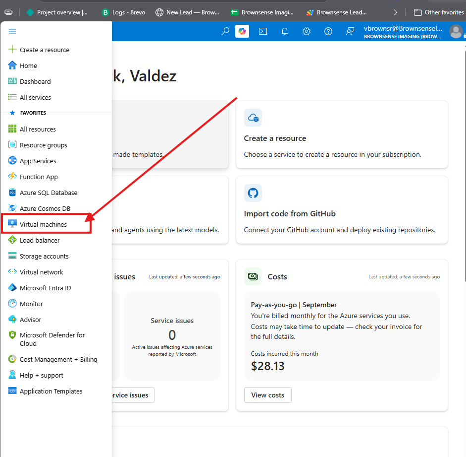
Started from the Azure Portal home and navigated to Virtual Machines to begin building the dedicated lab environment for this project.
Step 2: Create the VM
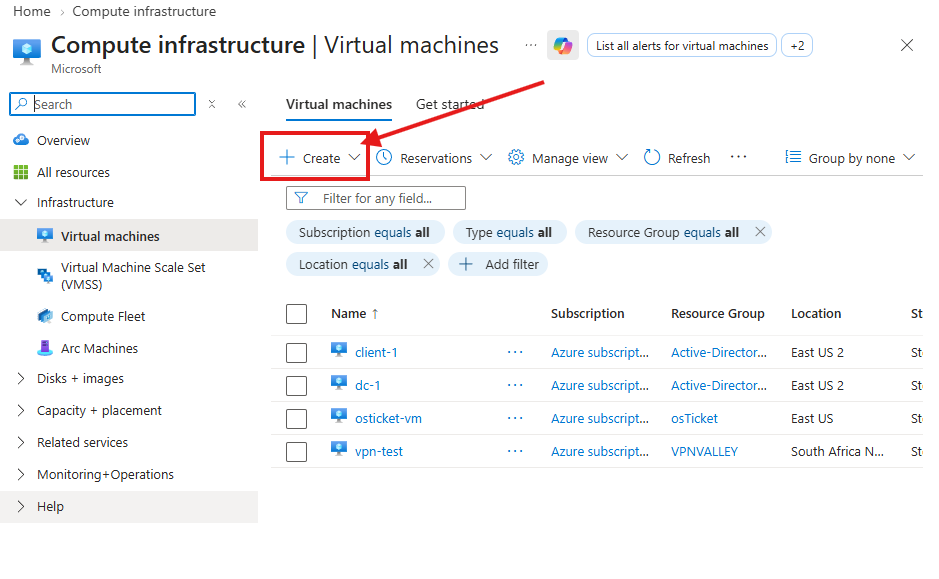
Opened the Virtual Machines blade and selected Create to configure a new Windows VM (`osticket-manual-vm`) in its own resource group (`rg-osticket-manual`), keeping this project isolated from other Azure resources.
Step 3: Deployment in progress
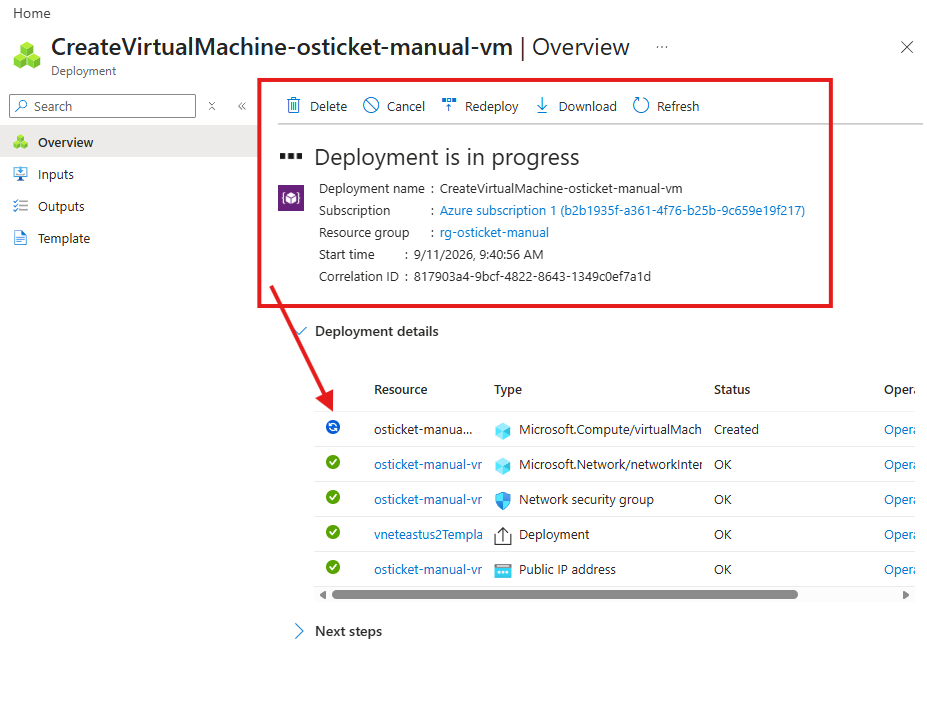
Azure provisioning the VM, along with its supporting resources — network interface, network security group, and public IP address.
Step 4: VM created
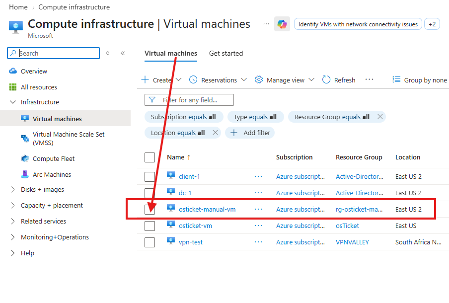
`osticket-manual-vm` now appears in the Virtual Machines list under the `rg-osticket-manual` resource group.
Step 5: VM running
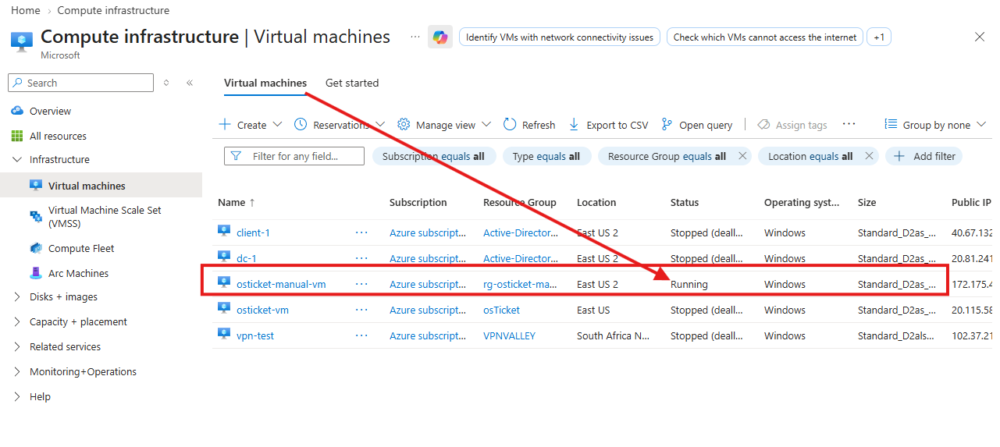
Confirmed the VM's status is Running before connecting over RDP to begin the software installation.
Step 6: Enable the CGI role feature in IIS
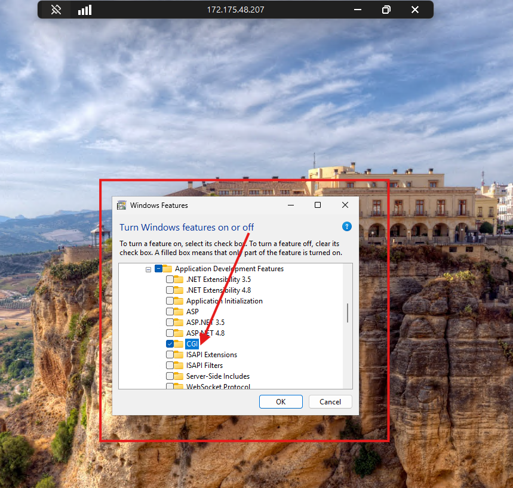
Inside the VM, opened Turn Windows features on or off and enabled CGI under Application Development Features — this is what allows IIS to run PHP through FastCGI.
Step 7: Windows feature installation complete
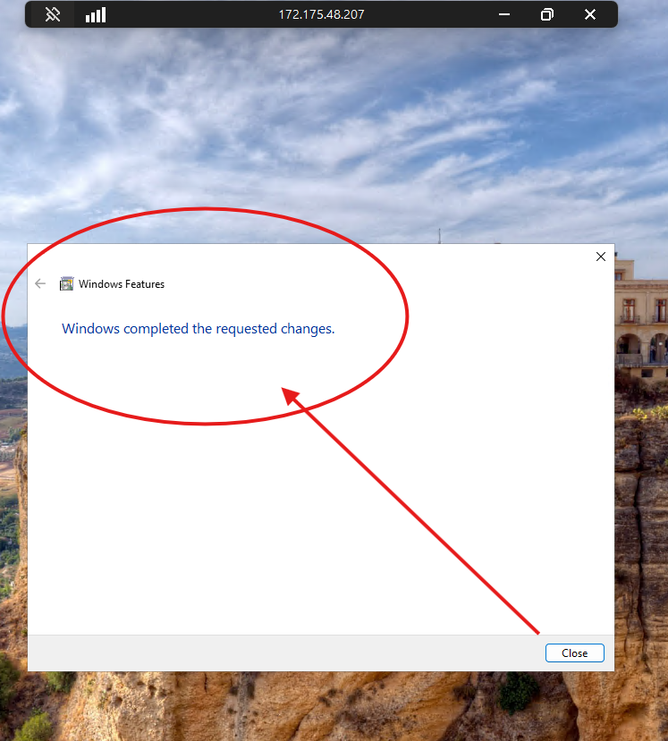
Confirmation that IIS and the CGI feature finished installing successfully.
Step 8: Verify IIS is serving pages
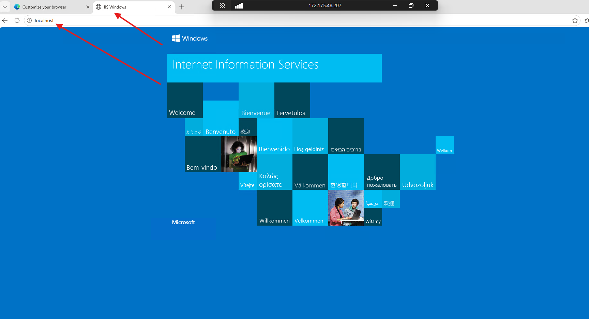
Browsed to `localhost` and confirmed the IIS default welcome page loads, verifying the web server is running before layering PHP on top of it.
Step 9: Register and verify PHP
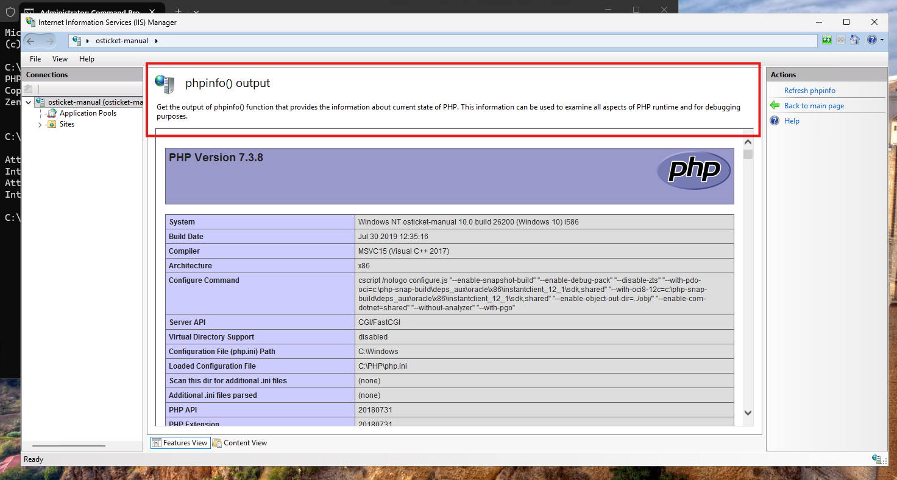
Registered PHP 7.3.8 with IIS through PHP Manager and used the built-in Check phpinfo() action to confirm the runtime is loaded correctly, running as CGI/FastCGI.
Step 10: Confirm MySQL is running
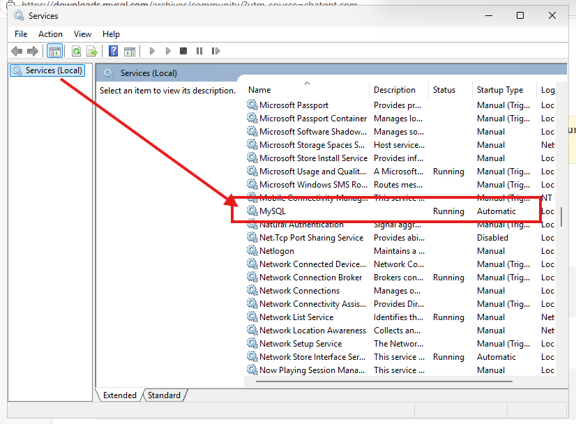
Verified the MySQL service is installed, set to Automatic startup, and currently Running in the Windows Services console.
Step 11: Connect to MySQL from the command line
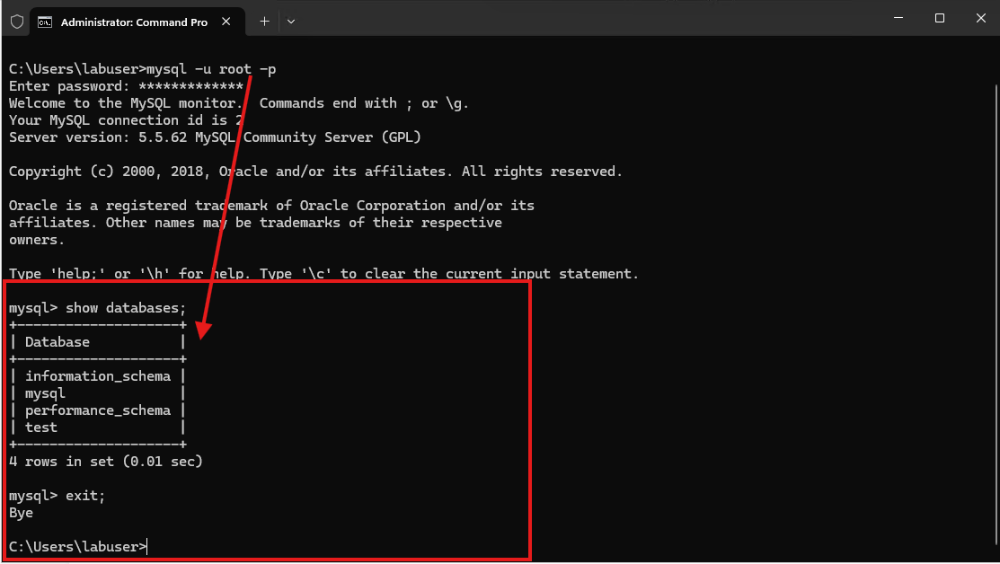
Logged into the MySQL command-line client as root to confirm connectivity and review the default system databases before creating one for osTicket.
Step 12: Create the osTicket database
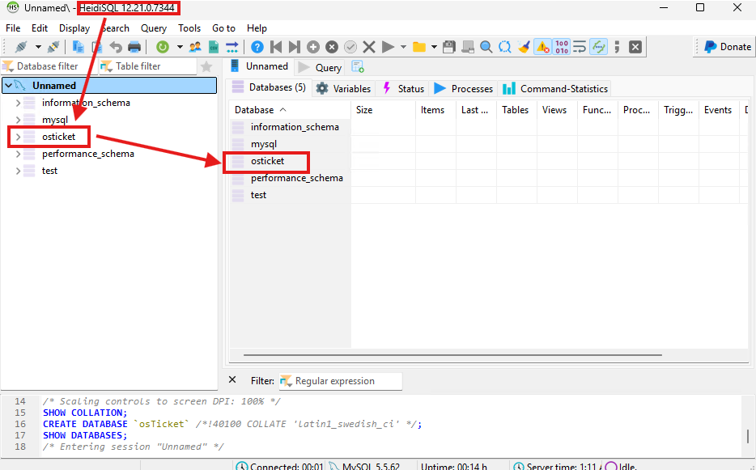
Used HeidiSQL as a GUI client to create the empty `osticket` database that the installer will connect to.
Step 13: Deploy the osTicket application files
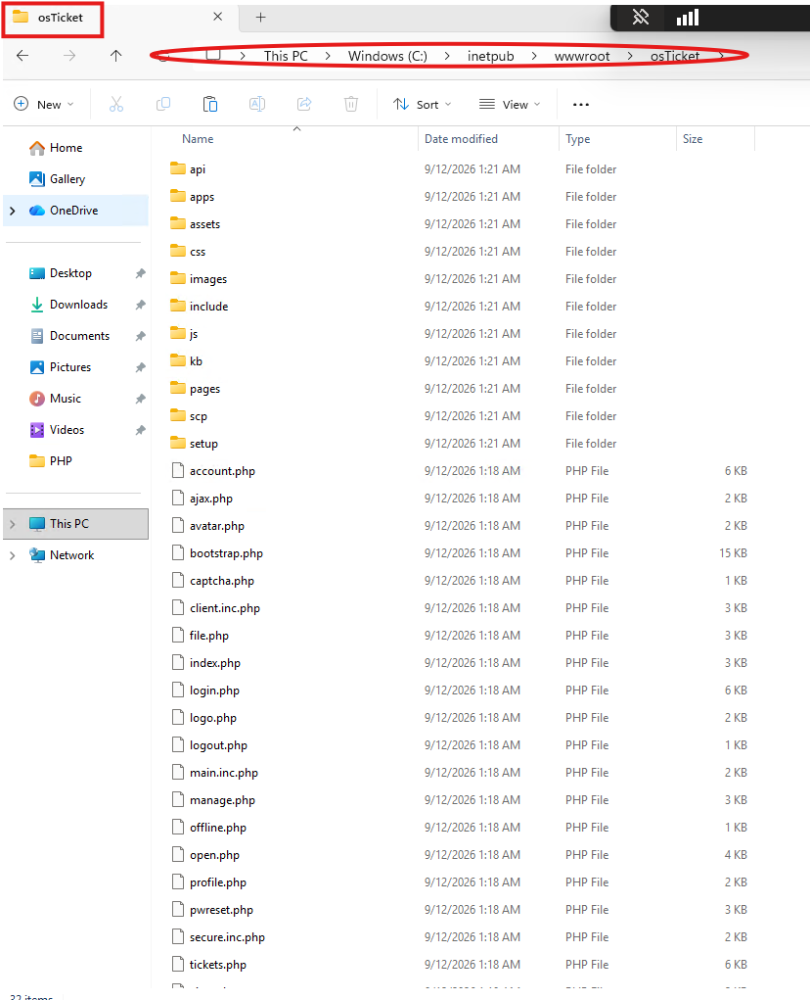
Copied the osTicket application files to `C:\\inetpub\\wwwroot\\osTicket`, the site's IIS web root, and renamed `ost-sampleconfig.php` to `ost-config.php` ahead of running the web installer.
Step 14: Run the osTicket installer — prerequisite check
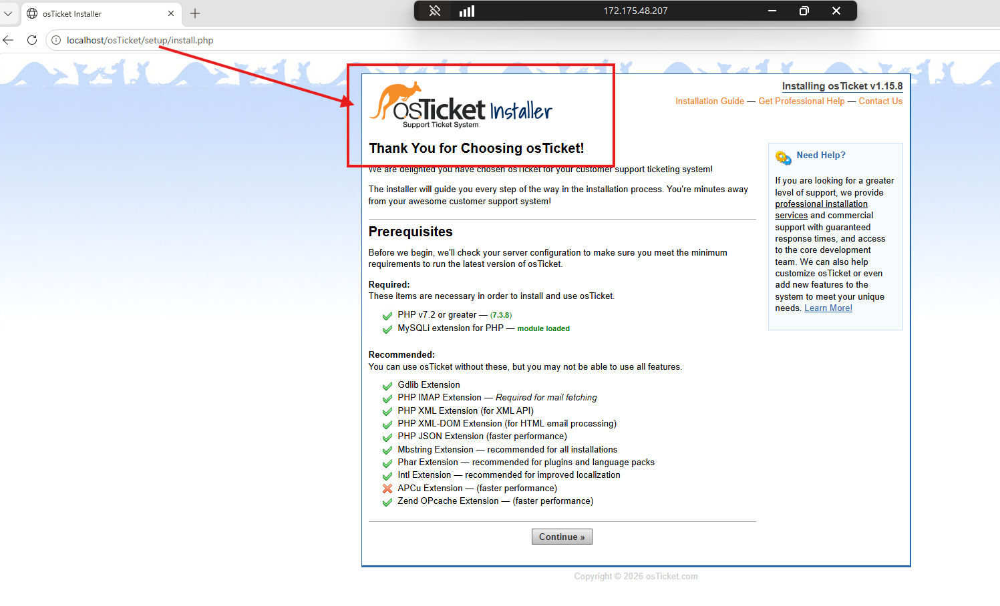
Launched the web-based installer at `/setup/install.php`. It confirmed PHP 7.3.8 and the MySQLi extension met the required minimums, and that all recommended extensions (Gdlib, IMAP, XML, XML-DOM, JSON, Mbstring, Phar, Intl, Zend OPcache) were enabled — proof the environment was configured correctly before installing.
Step 15: Complete the install and clean up
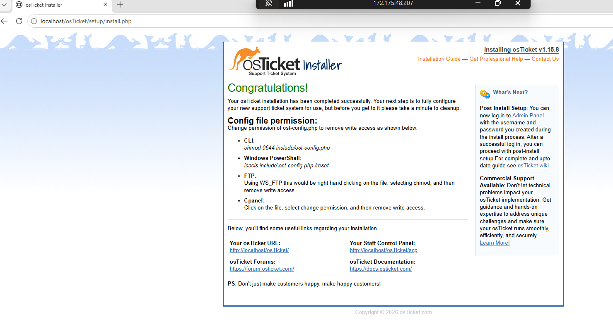
Installation completed successfully. The installer's post-install checklist calls out removing write access from `ost-config.php` and cleaning up the `/setup` folder — both standard hardening steps applied after this screenshot.
Step 16: Verify the live system
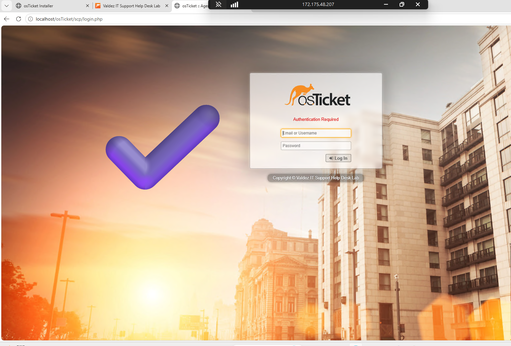
Confirmed the finished system is live by loading the Agent Panel login screen, custom-branded for this lab.
Conclusion
This project stood up a full osTicket help desk environment from scratch on Windows/IIS — provisioning the Azure VM, enabling and verifying IIS with the CGI feature, registering PHP and confirming its extensions, standing up and connecting to MySQL, and running the osTicket installer to a clean, verified finish. This environment is what Ticket Triage & Escalation Workflow builds on for hands-on help desk practice.
